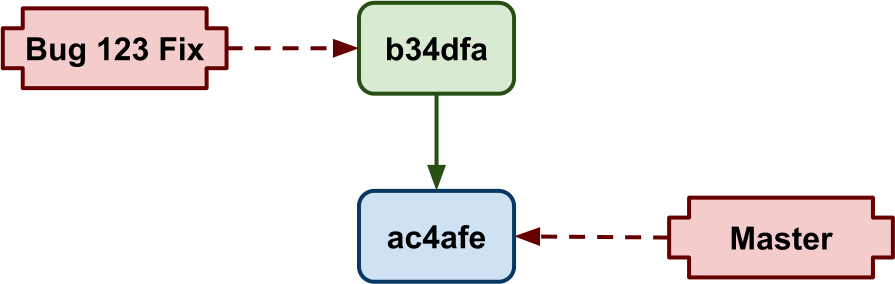
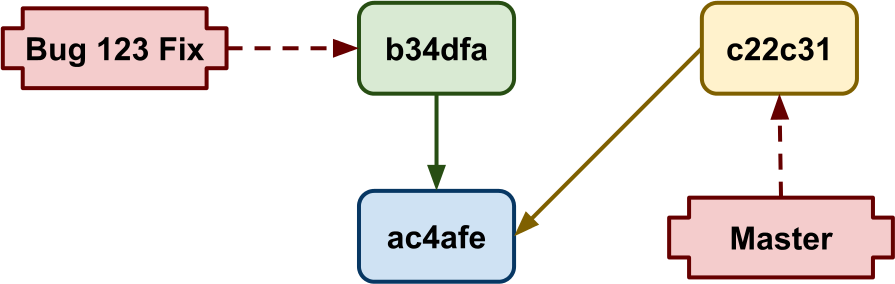
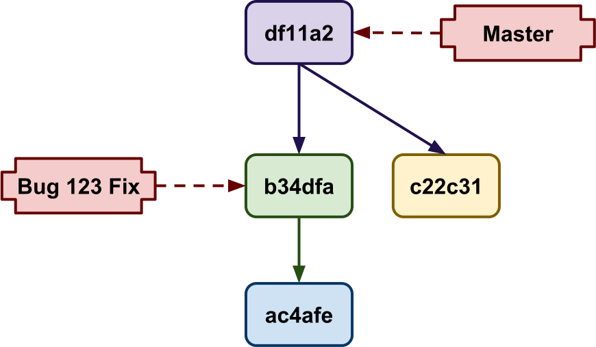
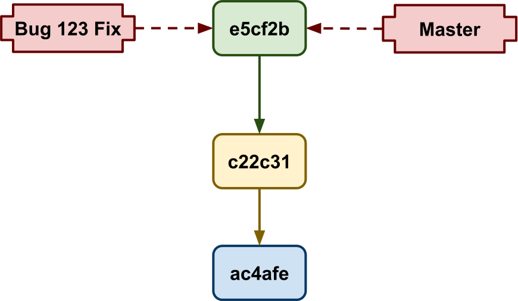

!SLIDE
# Git
## Commits are modular
## Commits are maleable

!SLIDE center

!SLIDE center

!SLIDE center

!SLIDE center

!SLIDE bullets
# Git

* Locally the way **you** want
* Remotely the way your **team** wants it

!SLIDE center

!SLIDE bullets
# Git commits

* Author **and** committer
* Message conventions for other roles